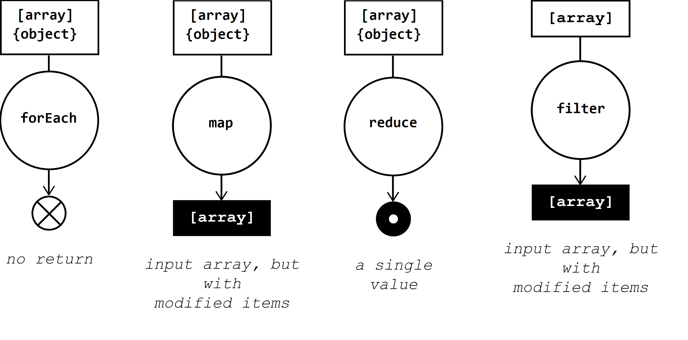

# Métodos de Array Propios (forEach, map, filter, reduce)

Este ejercicio esta basado para aprender la logica que hacen los métedos de arrays más utilizados cuando se invocan y aprender como funcionan las callbacks.

Además se ha añadido funcionalidad que no proporcionan estos métodos **(Iterar objetos)**.



### Objetos de ejemplo

``` javascript 
var objX = {
    id: 1,
    nombre: "Antonio",
    apellido: "Machin"
}

var arrX = [5, 2, 3];
```

# ForEach
Itera un array con una función que utiliza un bucle `for`.

## Array

``` javascript
forEach(arrX, (item)=>{
    console.log(item)
});

//expected output: 5
//expected output: 2
//expected output: 3
```
### Sintaxis
``` javascript
forEach(arr, function callback(value, indice, vector) {   
    // tu iterador   
});
```

## Objeto
``` javascript
forEach(objX, (key,value)=>{
    console.log(key + " = " + value)
});

//expected output: id = 1
//expected output: nombre = Antonio
//expected output: apellido = Machin
```

### Sintaxis
``` javascript
forEach(arr, function callback(key, value, indice, vector) {   
    // tu iterador   
});
```

# Map
Crea un nuevo array con los resultados de la llamada a la función indicada aplicados a cada uno de sus elementos, para iterar se reutiliza el metodo forEach.

## Array

``` javascript
var arr = map(arrX, function (item) {
    return item * 2
});

console.log(arr1);

//expected output: [ 10, 4, 6 ]
```
### Sintaxis
``` javascript
map(arr, callback(item, indice, vector) {
    // Elemento devuelto de nuevo_array
});
```

## Objeto
``` javascript
var arr1 = map(objX, function (key,value) {
    return value + " ejemplo"
});

console.log(arr1);

//expected output: [ '1 ejemplo', 'Antonio ejemplo' ]
```

### Sintaxis
``` javascript
map(obj, callback(key,value, indice, vector) {
    // Elemento devuelto de nuevo_array
});
```


# Filter
Crea un nuevo array con todos los elementos que cumplan la condición implementada por la función dada, para iterar se reutiliza el metodo forEach.  
En el método filter **solo** se usan **arrays**.

Para este metodo utilizaremos un array diferente:
``` javascript 
var arr = [{
    id: 1,
    nombre: "Antonio"
},
{
    id: 2,
    nombre: "Pepe"
},
{
    id: 3,
    nombre: "Antonio"
}]
```

## Array

``` javascript
var arr1 = filter(arr, function (item) {
    return item.nombre === "Antonio"
});

console.log(arr1)

//expected output: [ { id: 1, nombre: 'Antonio' }, { id: 3, nombre: 'Antonio' } ]
```
### Sintaxis
``` javascript
filter(arr, callback(item, indice, vector) { 
    // Condición filtro
});
```


# Reduce

Aplica una función a un acumulador y a cada valor de un array (de izquierda a derecha) para reducirlo a un único valor.

## Array

``` javascript
let arr1 = reduce(arrX, function (valAnterior, valActual) {
    valAnterior += valActualKey
    return valAnterior
},0);

console.log(arr1);

//expected output: 10
```
### Sintaxis
``` javascript
reduce(arrX, callback(acumulador, valActual, indice, vector) {
    // Operación
},valorInicial);

```

## Objeto
``` javascript
let obj1 = reduce(arrX, function (valAnterior, valActualKey, valActualValue){
    valAnterior.push(valActualKey)
    return valAnterior
},[]);

console.log(obj1);

//expected output: [ 'id', 'nombre', 'apellido' ]
```

### Sintaxis
``` javascript
reduce(obj, callback(acumulador,key, valor, indice, vector) {
    // Elemento devuelto de nuevo_array
},valorInicial);
```


